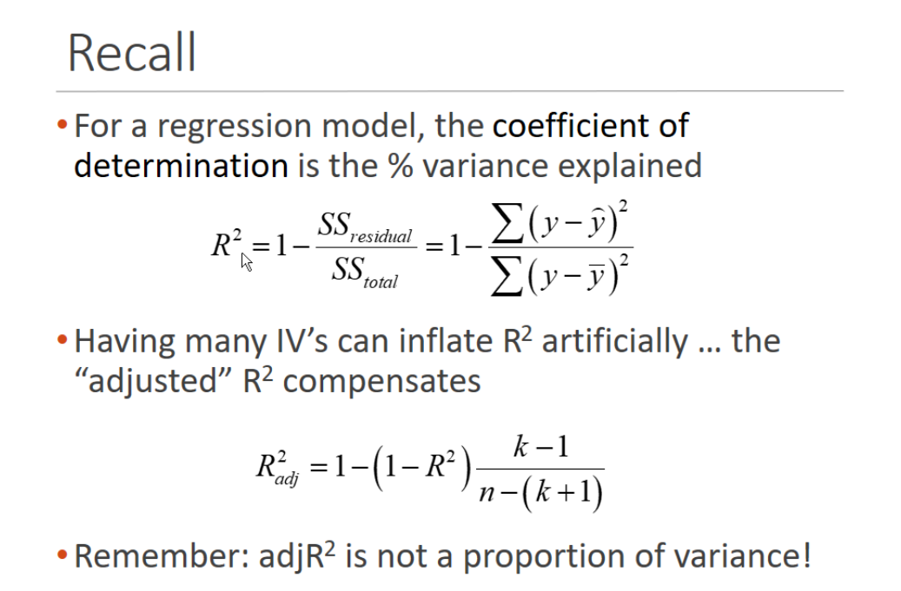
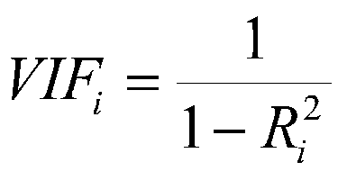
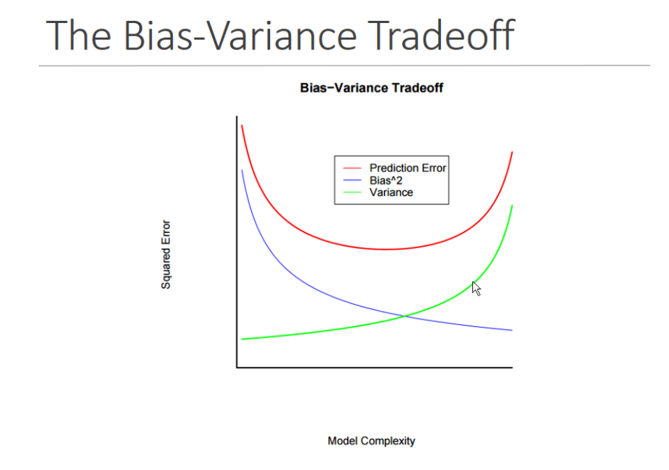
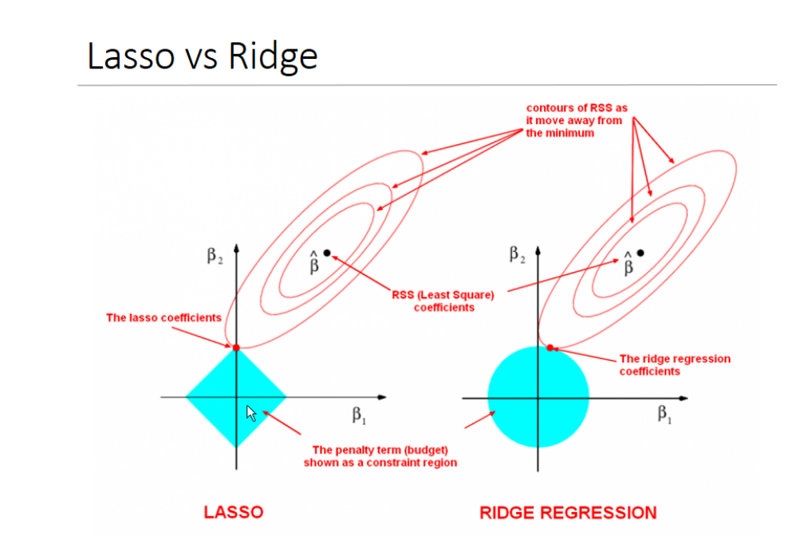
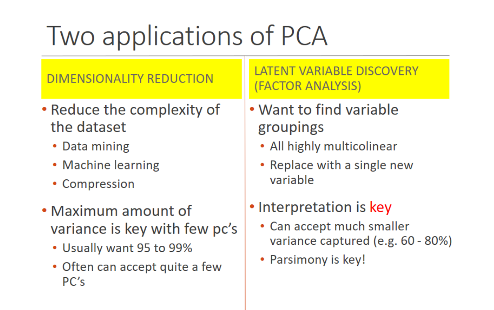
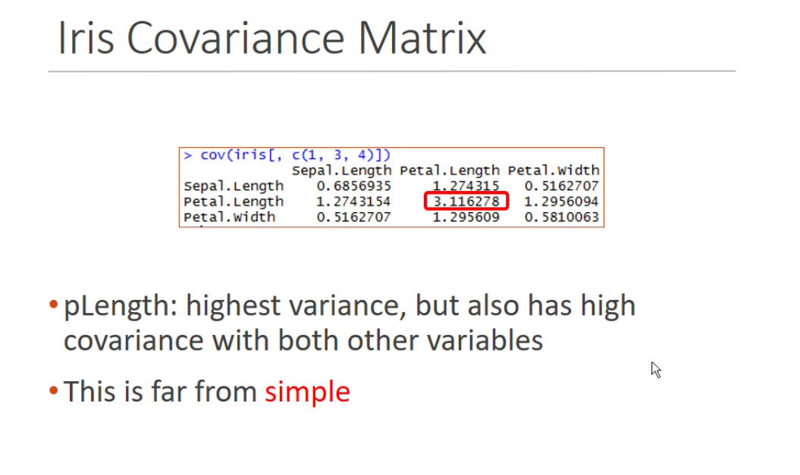
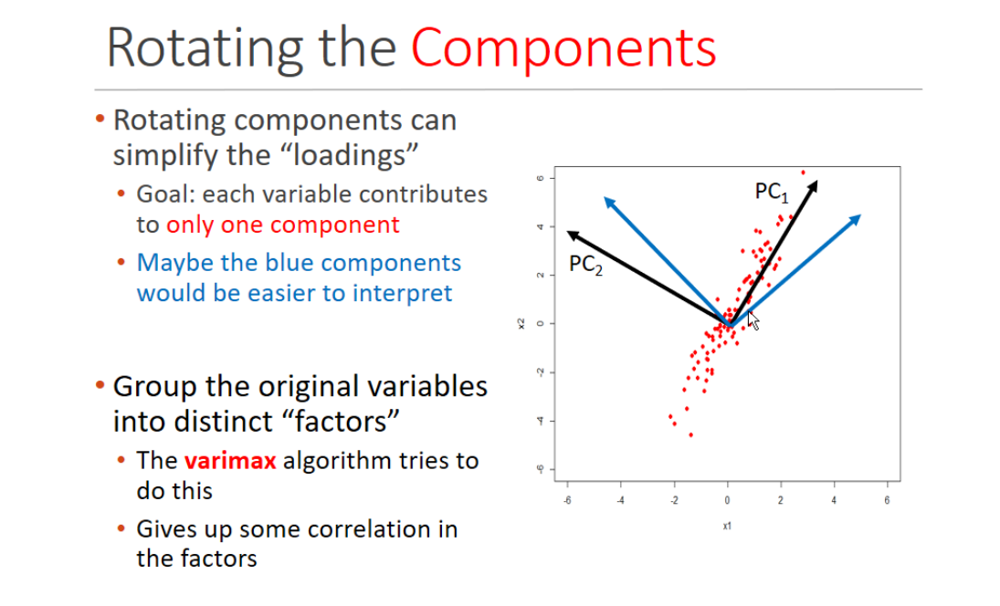
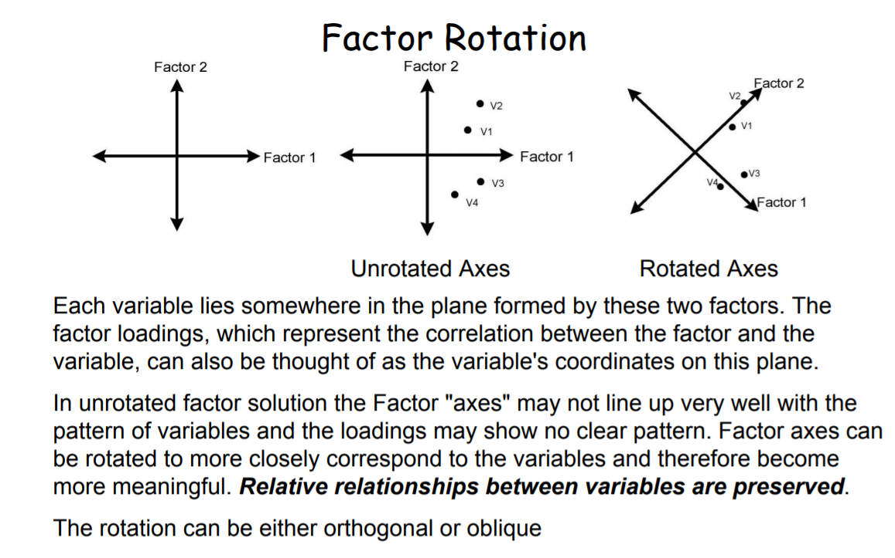
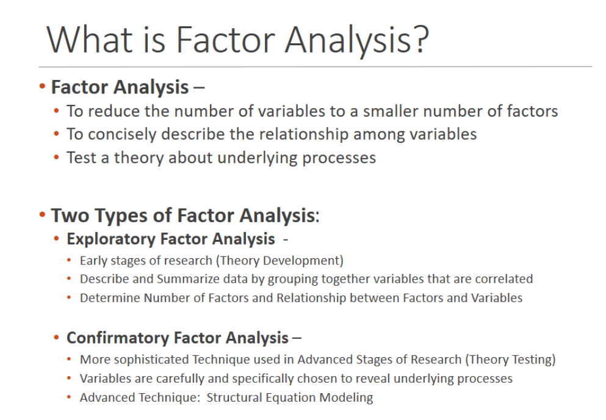
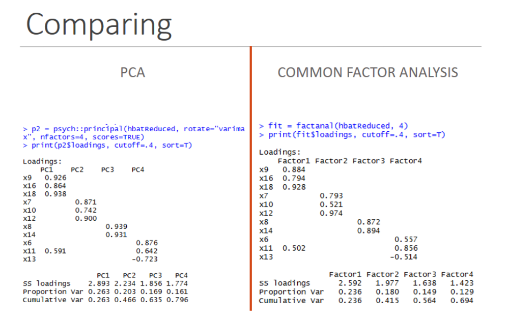

```{r}
library(knitr)
setwd("/home/jmoy001/Documents/Presentation")
read_chunk("Presentation_DSC424.R")
knitr::opts_chunk$set(echo = TRUE)
```

### Load Libraries
```{r C1, results="hide", warning=FALSE, message=FALSE}
```


#Table of Contents
* Interpreting Regression Summary

* 4 Assumptions of a Good Regression Model

* Multicollinearity?
1. Why is Multicollinearity bad?
2. Solutions towards overfitting?

* Ways to Handle Multicollinearity?
1. Regularized Regression
2. PCA
3. Factor Analysis

### Interpreting Regression Summary
```{r C2, fig.height=8, fig.width=8, warning=FALSE}
```
-Call: Provides the formula that you've inputted into the model

-Residuals:
Five number summary of the residuals
Residual = actual - predicted
Shows the distribution of error

-Coefficients:

Estimate:
Intercept: Average value of Y when x=0
Cannot interpret this, doesnt make sense.
ex) Suggests that when all explanatory variables are equal to zero, satisfaction is -2.08.

Betas: Shows us the numerical relationship between the variable and dependent variable (Practical Significance)
Ex) X6, X10, X11,...., X18

Interpretable: A one unit increase in Product Quality, there is an expected change in Satisfaction by .41.

Std. Error: Estimate of Variability

Since this is an estimate of a coefficient, there is some error.
Standard error is the variability that we would expect if sampling is done
Ex) Analysis done at different periods

t value:
Ratio of the Estimate/Standard Error
How big is my estimate relative to my error?

T value comes with a p value. Most common when checking whether a variable is significant or not.

p value: Check whether a variable is statistically significant or not.
ex) What is the probability that the variable is equal to 0 (statistically insignificant)

Recall Hypothesis Testing
Null Hypothesis: H0) There is no difference
Alt Hypothesis: H1) There is a difference

Usually test a p-value against an alpha level (.05 is the standard)
Alpha can be .01, .05, .1. How much error will you accept for the variable?

Residual Standard Error:
AKA Root Mean Squared Error (RMSE), Regression Standard Error, etc

Shows how poorly the model does at predicting Y values in the data on average.
The smaller the RMSE, the better

Multiple R-Squared: Percentage of variance explained of the dependent variable by the model.
In other words, how well does your model fit the dependent variable

Ideally, want multiple R-squared to be high. In some fields, .2 and .3 are considered high. But ultimately, the field of application you are using regression in will determine the adequate level of Multiple r-squared.


Adjusted R-Squared:
By adding more variables to your model, it will increase the multiple R-squared, whether it is useful or useless variables. Adjusted R-Squared will penalize you for adding useless variables to your model.

You cannot interpret multiple R-squared the same as adjusted R-squared.


```{r, out.width = "800px"}

```


Adjusted R-squared will always be lower than multiple R-squared, so adding a useless variable to the model, will make that difference greater.

F-Statistic: Meaures significance of the overall model: Ratio of the model performance / error
Higher the F-statistic, the better

P-value: Shows the overall signifiance of the model


### The big question, is this a good regression model???


### The Four Assumptions for a Good Regression Model

1. Normality of the error distribution (Residuals should be normally distributed)

2. Linear relationship between the dependent and independent variable

3. Statistical independence of the errors (No Multicollinearity)

4. Homoscedasticity (Constant Variance)

```{r C2a, warning=FALSE}
```


By plotting the regression model, it generates 4 graphs for us.

Assumption 4 Test:
Residuals vs fitted/predicted: There should not be any patterns (random) and red line should be fairly flat.
Variability is about the same for different values of X (constant Variance)

Assumption 1 Test:
Normal Q-Q (Quantile-Quantile): If the residuals are approximately normally distributed, then most of the points should be relatively on the line. Some deviation is expected near the ends, but deviations should be small

Additional tests for normality of residuals:

Scale-Location: ensure our residuals are random, not having a pattern to them. If you see a cheese wedge, then we have variability, may need to do transformations or use another type of regression.

Residuals vs Leverage: may have outliers, take them out if they are not influential. Depends on application though.
Ex) Medical, might indicate a side effect
Dotted line, anything pass that shows influential outiers. If we take outliers out, will change data.


Function to check assumptions automatically
```{r C2b, warning=FALSE}
```


###Have all the assumptions been verified?


Not quite,
3. Statistical independence of the errors (No Multicollinearity)

Variance Inflation Factor - Metric computed for every X variable that goes into the model. If the VIF of a variable is high, it means the information in the variable is already explained by other X variables present in the given model (more redundant information).

Hence, the lower the VIF, the better.

In the background: VIF function runs auxiliary regressions for each independent variable and records the R-squared to be calculated by VIF formula below.

```{r, out.width = "800px"}

```

Rule of Thumb:

1: No issues of multicollinearity

5-10: moderate issues of multicollinearity 

10-above: Major issues of multicollinearity

Note, in some contexts, a VIF of 2 could should major issues of multicollinearity

```{r C2c, warning=FALSE}
```

### Why is multi-collinearity bad???
Inflation of the Betas - may not make sense when interpreting
Ex)Inaccuracies in the computation of the betas

Change in the sign of the betas:
Ex)Positive correlation when using a corr matrix, but negative correlation in regression model)

```{r C2d, warning=FALSE}
```

* High error

* Big difference between the adjusted R squared and multiple R Squared


* Overfitting (symptom of multicollinearity) - Model created with training data has a high accuracy when applied to the training data, but low accuracy when applied to test data.


Causes of overfitting:
Data has too few data points for the number of parameters and features (Summit #3- Churn data)
Too many features that will make the model more complex

##### Solutions towards overfitting:

Cross validation: Instead of separating your data into a training and test set, partition the data into k folds.
1 fold is set aside for testing and the remaining folds are used for training. Then would average out the accuracy for each train/test data split. 
If the training accuracy from one model (train/test split) is similar to the cross validation model, there is no overfitting. However, if there is a big difference, this is due to overfitting.

Pruning using Decision Trees: Idea is to classify the data into trees by variable importance.
Ex) Depending on the outlook(sunny, overcast, rain), was the most important variable in deciding whether or not you will go play tennis outside. Shows the probability for each outlook and shows the next variable(temperature) of importance until all data has been classified. Model will be way too complex. 
To avoid overfitting, prune the tree(stop splitting) when tree is no long statistically significant.

Regularized Regression: Reduces overfitting by adding a penalty for model complexity or extreme parameter values (high betas due to multicollinearity). The penalty parameter is lambda, where if the value is too low, it wont do anything to treat it as an Ordinary Least Squares (OLS) Regression and if too high, will add too much weight and will underfit the model.

Three types of Regularized Regression:

1) Lasso Regression - Stands for Least Absolute Shrinkage and Selection Operator. Uses L1 normalization and adds the absolute value of magnitude of the coefficient as a penalty term to the loss function. Also performs feature selection by shinking the betas of the less important features to zero.

2) Ridge Regression - Uses L2 normalization and adds a squared magnitude of coefficient as a penalty term to the loss function. Ridge regression does not offer feature selection like Lasso does, but by viewing the graph of lambda against the Mean Squared Error (MSE), allows you to select the lambda used to optimize the model by choosing the smallest MSE.

3) Elastic Net - Combination of Ridge and Lasso Regression


```{r, out.width = "800px"}

```

Another thing that comes into play with model building is parsimony. Want to have a small number of variables in the model. Because as we increase the number of variables in the model (hence the model complexity), will be increasing variance and increasing prediction error.


```{r, out.width = "800px"}

```
Any betas inside the circle (constraint region) is fine.
Lasso has that shape (diamond) since unimportant features are penalized to 0 (lie on the axis)


```{r C2e, warning=FALSE}
```

###Ways to Handle Multicollinearity?

Regularized Regression - Ridge, Lasso, and Elastic Net

Principal Component Analysis

```{r, out.width = "800px"}

```

Dimensionality reductions - Want to keep as many features as possible to be explained in components (grouped features). Reduce the amount of variables in your dataset to a few principal components that explains the variance.


Latent Variable Discovery - Want to interpret components.
Ex) Lots of independent variables are highly correlated. Can we group the variables into their own distinct component that is not correlated with other components and is interpretable?

####Purpose of PCA stems from Variance

```{r, out.width = "800px"}

```


The total variance is summed up on the diagonals of the covariance matrix. A ratio between the components and the overall sum of the variance shows how much variance does each component explain.

Main Idea: Have a lot of multicollinearity in the data. Trying to keep as much variables as possible by putting them into smaller components, to reduce multicollinearity.


```{r, out.width = "900px"}

```

Taking variables that are correlated and rotating it so that it is uncorrelated on the worlds axis.

```{r, out.width = "900px"}

```

By rotating the axis, it redistributes the variance and makes the loadings much easier to interpret.

In summary, PCA replaces original variables with new variables (Principal Components) that are orthogonal (zero covariance) and have variances (eigen values) in decreasing order.

#### HBAT Example

#####Correlation Plot to see principal component groupings

```{r C3a, warning=FALSE}
```

#### 3 Methods to check for the # of components to have in your model

#### Scree Plot

```{r C3b, warning=FALSE}
```


#### Knee of Scree Plot
```{r C3c, warning=FALSE}
```


#### Cumalative Variance (60-80% if Latent Variable Discovery)

```{r C3d, warning=FALSE}
```


#### Test # of components and interpretability of PCA
```{r C3e, warning=FALSE}
```


### PCA Project

```{r C4a, warning=FALSE}
```


There are 84 variables that represent the number of students that scored a 4 on their math or ela test of various ethnicities and grade that are highly correlated. Is it possible to use PCA to form components that are interpretable and remove multicollinearity?


##### Kaiser-Meyer-Olkin (KMO)
KMO tests the sampling adequacy to verify that the data has a large enough sample. 
(.7 and above)


```{r C4b, warning=FALSE}
```

##### Bartlett's Test of Sphericity:
Barlett's test of Sphericity tests if there are enough shared variance within the data set.  
(p value: .05 < below)

```{r C4c, warning=FALSE}
```


##### Crombach's Alpha
Cronbach's Alpha is used to test the reliability, which means do the variables and the groupings make sense (theory and conceptually) and can be used for later analysis?
(.7 and above)

```{r C4d, warning=FALSE}
```


####Keep in mind that PCA, FA, CCA, Correspondence Analysis, and LDA are version of linear combinations, all will require assumptions for regression analysis.


#### Ready to perform PCA

```{r C4e, warning=FALSE}
```


Factor Analysis

```{r, out.width = "900px"}

```


Exploratory Factor Analysis: Similar to PCA
In a regression model, have a lot of multicollinearity from the correlations and VIF, but want to keep all those variables in there because they are important to you. So will try a factor analysis to reduce them down while reducing the multicollinearity. Then determine the number of factors, the name for those factors, establish relationship from the loadings.


Confirmatory Factor Analysis: May or may not have a definitive number of components, can you establish a theory of your own to determine the number of components.
We've established a theory from exploratory factor analysis, will now look at indirect and direct variables. Taking the variables of those components and seeing if there are other variables that provide a direct and in-direct relationships to our outcomes variables.

Ex) Journal Article already published, trying to mimic relationship from previous research to match your own use case of principal components derived from analysis.


```{r C5a, warning=FALSE}
```

Comparison between PCA and Factor Analysis

```{r, out.width = "900px"}

```


Cumulative variance is a lot smaller on the Common Factor Analysis than PCA.
Why? PCA includes all variance (unique, error, and common shared variance).

In Common Factor Analysis, it only uses the common shared variance.

If you can assume or understand from the domain(error and unique variance), use PCA
If not known, use Factor Analysis.


